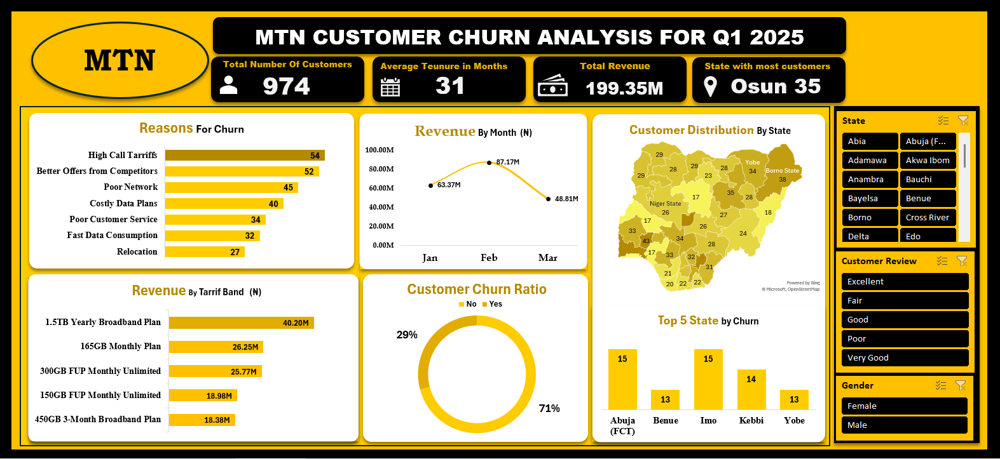

# Telecom customer churn analysis

**Question:** Which customer segments in a simulated telecom dataset show higher observed churn, and what should be investigated next?

The Excel workbook contains **974 simulated customer records**, purchase and revenue fields, a churn flag and reported reasons for churn. It is a portfolio exercise using MTN-themed sample data; the results are **not official MTN Nigeria statistics**.

## Method and findings

Use [`customer-churn-analysis.xlsx`](customer-churn-analysis.xlsx) to filter by state, plan, device, tenure and satisfaction. Calculate churn as customers flagged `Yes` divided by all 974 records; document any exclusions. The workbook contains **284 `Yes` flags and 690 `No` flags**, yielding **29.2% observed churn** (284 / 974). The portfolio site previously claimed **35% at risk**, a different and undocumented concept; that wording has been removed.

Reported reasons can guide investigation into tariff perceptions, competing offers, network quality and service, but they cannot establish causality. The original README's annualised revenue-risk figure assumes a repeatable revenue period; treat it as a scenario only if the revenue definition and time period are confirmed.

## Decision use and limits

Prioritise segments using both churn rates and segment sizes. Avoid treating a small group's high rate as equivalent to a larger group's total customer loss. Recommendations are proposals for a simulated case; no real retention impact was measured.

## Files

| File | Purpose |
| --- | --- |
| [`customer-churn-analysis.xlsx`](customer-churn-analysis.xlsx) | Excel data and analysis workbook |
| [`images/customer-churn-dashboard.png`](images/customer-churn-dashboard.png) | Dashboard preview |
| [`images/`](images/) | Additional report screens |
| [`MTN_Churn_Analysis_Report.docx`](archive/MTN_Churn_Analysis_Report.docx) and [`MTN_Churn_Analysis.pptx`](archive/MTN_Churn_Analysis.pptx) | Report and presentation |

**Analyst:** [Chukwuemeka Ogo](https://mikkymo.github.io/portfolio/) · [LinkedIn](https://www.linkedin.com/in/ogochukwuemeka/)
